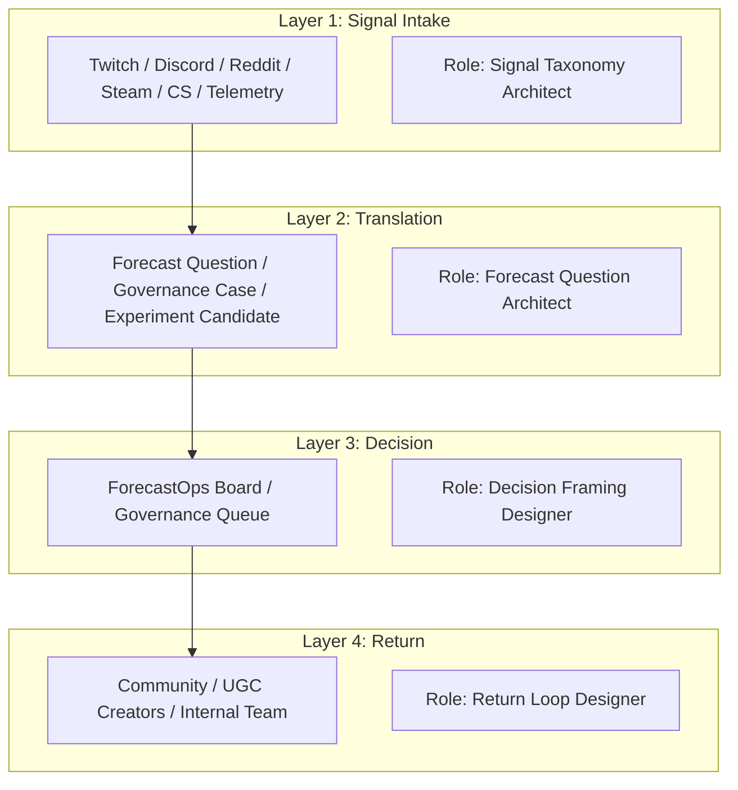

# Community Forecast Ops

> **Translating community signals into actionable game design decisions and governance.**
>
> **コミュニティの信号を、ゲームデザインの意思決定とガバナンスへ翻訳する。**

## 1. Project Overview
**Community Forecast Ops** は、単なる「SNS分析ツール」ではありません。コミュニティから発せられる混沌とした信号（Signals）を、ゲーム会社が意思決定可能な「問い（Forecast Questions）」へと翻訳し、その決断を再び共同体へと還元する**「判断インフラ（Decision Infrastructure）」**の設計・運用プロジェクトです。

### オーナーの役割：コミュニティ予測アーキテクト
本プロジェクトのオーナーは、システムエンジニアではなく、**コミュニティ予測アーキテクト（Community Forecast Architect）**として機能します。その役割は、コミュニティの信号を組織の意思決定プロセスに適合する形式へ変換し、開発チームとプレイヤー間のフィードバックループを制度化することにあります。

このシステムは、従来の「定性的なエゴサーチ」や「単なる同時視聴者数の追跡」では不十分だった、**「コミュニティの熱量や不満を、具体的にいつ、何をすべきかという判断にどう結びつけるか」**という課題を解決します。

---

## 2. 4-Layer Architecture
本システムは、信号の受容から還元までを4つの層で管理しています。



---

## 3. Tool Architecture
本プロジェクトは、3つの立ち位置の協調によって運用されます。

| 役割層 | 担当エージェント/主体 | 主な責務 |
| :--- | :--- | :--- |
| **作る層** | **Antigravity** | APIスクリプト作成、テストコード、データ構造（JSON/CSV）の初期設計 |
| **回す層** | **Cowork** | 週次パイプラインの実行、Notion書き込み、ログのステータス更新 |
| **決める層** | **オーナー (Human)** | 問いの最終確認、意思決定の承認、Return Memoの送信承認 |

---

## 4. Current Status

### 実装済み（Phase 1: Basic Intake & Pipeline）
- **`twitch_monitor.py`**: Twitch APIを用いたリアルタイム監視。同時視聴者、クリップ生成数、チャット感情の3指標を追跡。
- **Cooldown Logic**: 同一信号の重複検知と記録抑制。
- **`Signal_Intake_Log.csv`**: Cowork仕様に準拠した16列の信号ログ。
- **Standard Pipeline**: Triage → Translation → Board → Return のプロセス確立。
- **実績**: 第1サイクル完了（2026-03-17）。

### 未実装（Phase 2以降）
- [ ] Discord 収集スクリプト (`discord_collector.py`)
- [ ] Reddit 収集スクリプト (`reddit_collector.py`)
- [ ] Steam API 連携（レビュー・プレイヤー数推移）
- [ ] Cross-platform Spread 判定（複数プラットフォームでの拡散検知）

---

## 5. Folder Structure
```text
Community_Forecast_Ops/
├── 00_Config/
│   ├── COWORK_INSTRUCTIONS.md         # Coworkへのプロンプト指示
│   ├── signal_taxonomy.md             # [Upcoming] 信号の分類体系定義
│   └── forecast_question_template.md  # [Upcoming] 予測質問のテンプレート
├── 01_Signal_Log/
│   └── Signal_Intake_Log.csv          # 全信号の源泉
├── 02_Translation_Briefs/
│   └── YYYY-MM-DD_TRN-XXX_[topic].md  # 信号からドラフトされた分析書
├── 03_Decision_Board/
│   └── YYYY-MM-DD_DBM-WXX.md          # 意思決定会議用アジェンダ
├── 04_Return_Memos/
│   ├── YYYY-MM-DD_return_discord.md   # 返答案（Discord用）
│   ├── YYYY-MM-DD_return_reddit.md    # 返答案（Reddit用）
│   └── YYYY-MM-DD_return_internal.md  # 社内向けフィードバック
├── scripts/
│   ├── twitch_monitor.py              # Twitch監視エンジン
│   └── tests/
│       └── test_monitor.py            # 単体テスト
├── .env.example                       # 環境変数テンプレート
├── negword_list.txt                   # 感情分析用除外・ネガティブワード
├── baseline_stats.json                # 統計ベースライン
└── README.md                          # 本ドキュメント
```

---

## 6. Weekly Operation Cycle

| 曜日 | 活動 | 実行主体 | 所要時間 |
| :--- | :--- | :--- | :--- |
| **Mon** | **Intake & Triage** | twitch_monitor & Cowork | 5 min |
| **Wed** | **Translation** | Cowork & **Owner (Check)** | 15 min |
| **Fri** | **Decision Board** | Cowork & **Owner (Approve)** | 15 min |
| **Sat** | **Return** | Cowork & **Owner (Send)** | 10 min |

**Total Manual Work**: 週約45分。人間は「決定」に集中し、「作業」はAIエージェントに委任。

---

## 7. Document Templates
本プロジェクトを運用するために、以下の7種類の標準テンプレートを用いています：
1. **Community Signal Intake Log**: 全プラットフォーム統合ログ
2. **Signal Translation Brief**: 信号の文脈化
3. **Forecast Question Sheet**: 「明日の確率は？」を問うシート
4. **Governance Case Sheet**: ルール変更が必要な場合の提案書
5. **Decision Board Memo**: 決裁者向けの要約
6. **Return / Feedback Memo**: コミュニティへの回答案
7. **Weekly Calibration Review**: 週次の精度振り返り

---

## 8. Future Projects (Roadmap)

### Project 02: UGC Predictive Governance (Pending)
- **Problem**: UGC（ユーザー生成コンテンツ）の評価が単純な人気投票に依存し、長期的な健全性が損なわれる。
- **Approach**: Survival (継続性), Stability (安定性), Safety (安全性), Culture Value (文化的価値) の5軸評価を導入。

### Project 03: Cross-Platform Decision Loop (Pending)
- **Problem**: プラットフォーム間で信号が分断され、多角的な判断が遅れる。
- **Approach**: 全プラットフォームの相乗効果を1つの Forecast Question に統合するロジックの開発。

### Project 04: Return Loop & Accountability Design (Pending)
- **Problem**: 「採用された要望」しか見えず、不採用の理由が不明なため不満が蓄積する。
- **Approach**: 保留や却下も含めた「説明責任」を果たすための制度的な返答設計。

---

## 9. What This Is NOT
- ❌ 新しいSNSを作るプロジェクトではありません。
- ❌ 単なるTwitchの数字を並べるダッシュボードではありません。
- ❌ フルスタック開発者の技術ポートフォリオではありません。
- ❌ コミュニティマネージャーの「頑張りました」記録集ではありません。

---

## 10. Glossary
- **Signal Taxonomy**: 混沌としたコミュニティの発言を整理するための分類学。
- **Forecast Question**: 具体的な期限と条件を設定した、予測可能な問い。
- **Governance Case**: 運用ルールや方針の変更が必要な事案。
- **ForecastOps Board**: 予測結果に基づき、リソース配分や方針を決定する会議体。
- **Return Memo**: 意思決定の結果を、対象に合わせたトーンで伝える文書。
- **Weekly Calibration Review**: 予測と実際の結果を照らし合わせ、モデルを修正するプロセス。
- **Brier Score**: 予測の正確さを測定する指標。0に近いほど正確。
- **Cooldown**: 同一Signal Typeの重複記録を防ぐ待機時間。デフォルト30分。.envのCOOLDOWN_MINUTESで設定可能。
